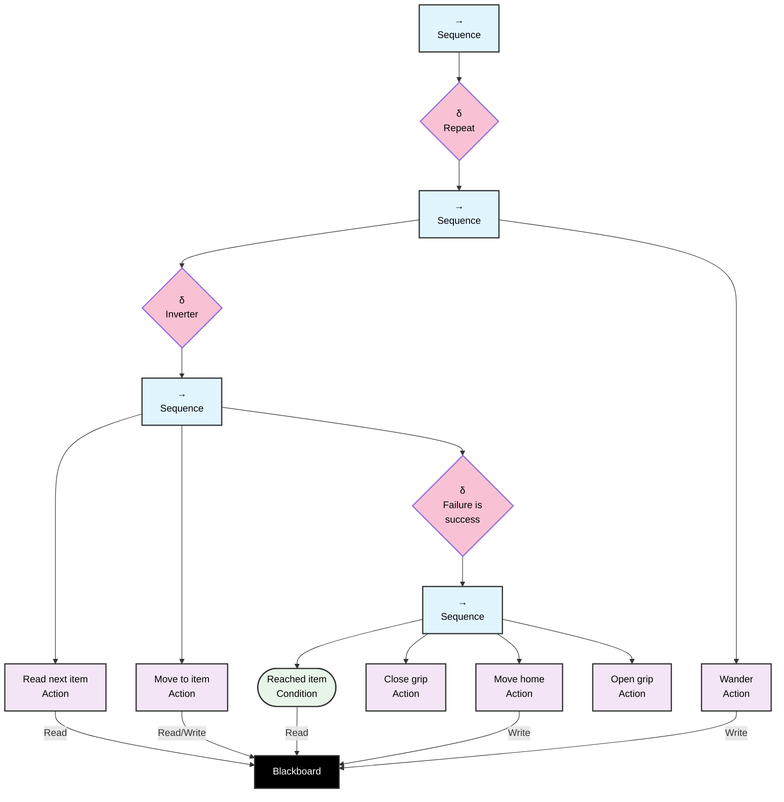

## Simulation Behavioural Tree Node Description

## Simulation Behavioural Tree Node Description

### Control Nodes

- **Root Sequence (→)**: Main sequence node that executes children from left to right. Succeeds if all children succeed.
- **Repeat(δ)**: Repeatedly executes child sequence
- **SeqGoal (→)**: Sequence node that executes the main task workflow.
- **Inverter**: node that inverts the result of actions, in this case if the reading from the blackboard fails, ending in a failure the sequence goes on to execute the wander action
- **SeqTask(→)**: sequence node that execute the main steps to get to the goal 
- **FailIsSucc(δ)**: node that considers failures as success
- **GoalReachedSeq(→)**: sequence node that executes the workflow to get the item and bring it to a desired location

### Condition Nodes

- **GoalReached** - Checks if the previously read item is reached

### Action Nodes

- **GetGoal**: Reads the next item from the blackboard
- **MoveToObj**: Moves the robot to the target item.
- **CloseGrip**: Closes the gripper to grasp the item.
- **MoveHome**: Returns the robot to the home position.
- **OpenGrip**: Opens the gripper to release the found item
- **Wander**: The robot wanders around the surrounding area

## Behavior Flow

1. The root sequence starts execution
2. Repeats the **SeqGoal**
    -   Starts **SeqTask**
    -   Reads an Item from the blackboard, if not found the **Inverter** sets the status to success and execute the wander action
3. If an item is found moves towards it executing **MoveToObj**
4. If the item is reached, the **GoalReachedSeq** executes
   - **CloseGrip**: Grasp the object
   - **MoveHome**: Return to home position
   - **OpenGrip**: Release the object

## Usage
To simulate the tree just execute the main.py script. You can pass the number of desired ticks to be simulated as an argument, so if using uv the command would be `uv run main.py 100` to simulate for 100 ticks. The default is 30