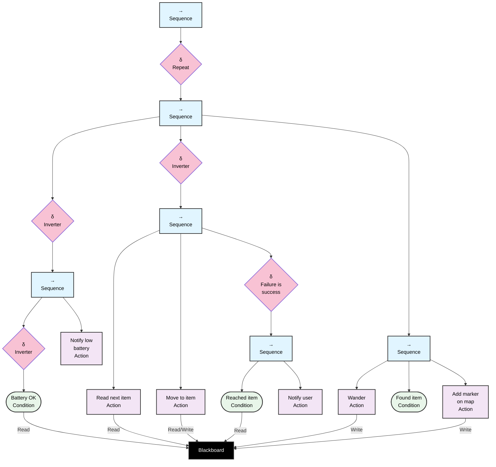

## Real world

## Simulation Behavioural Tree Node Description

### Control Nodes

- **Root Sequence (→)**: Main sequence node that executes children from left to right. Succeeds if all children succeed.
- **Repeat(δ)**: Repeatedly executes child sequence
- **SeqGoal (→)**: Sequence node that executes the main task workflow.
- **BatSeqInvert(δ)**: Interrupts the workflow if the robot doesn't have enough power
- **BatSequence(→)**: Sequence node that executes a battery check
- **BatInverter(δ)**: Node that considers success as failure, used to invert status from the battery check
- **Inverter**: node that inverts the result of actions, in this case if the reading from the blackboard fails, ending in a failure the sequence goes on to execute **WanderSeq**
- **SeqTask(→)**: sequence node that execute the main steps to get to the goal 
- **FailIsSucc(δ)**: node that considers failures as success
- **GoalReachedSeq(→)**: sequence node that executes the workflow to get the item and bring it to a desired location
- **WanderSeq(→)**: sequence that executes the wander routine

### Condition Nodes

- **BatteryCheck** - Checks if the battery level is above a threshold
- **GoalReached** - Checks if the previously read item is reached
- **FoundItem** - Checks if the requested item is found

### Action Nodes

- **BatNotify**: Notifies the user if the battery is low
- **GetGoal**: Reads the next item from the blackboard
- **MoveToObj**: Moves the robot to the target item
- **NotifyUser**: Notifies the user if the item is not found
- **Wander**: The robot wanders around the surrounding area
- **AddMark**: The robot adds a marker representing an item on the map

## Behavior Flow

1. The root sequence starts execution
2. Repeats the **SeqGoal**
3. Starts **SeqGoal**
4. Starts **BatSequence**
    - If **BatteryOK** succeeds → **BatInverter** considers it as a failure, this branch is interrupted
    - If **BatteryOK** fails → **BatInverter** considers it as a success
        - Execute **BatNotify**
        - **BatSeqInvert** interrupts the robot actions
5. If the battery is OK, execute **SeqTask**
    -   Reads an Item from the blackboard, if not found the **Inverter** sets the status to success and execute **WanderSeq**
    -   If an item is found moves towards it executing **MoveToObj**
    -   Execute **GoalReachedSeq**:
        - If **GoalReached** succeeds → **Inverter** considers it as a failure, the robot stops
        - If **GoalReached** fails → **FailIsSucc** considers it as a success
            - Execute **NotifyUser**
6. If the item is not found execute **WanderSeq**
    - Execute **Wander**
    - If **FoundItem** fails → the robot stops
    - If **FoundItem** succeeds the item is added to the map through **AddMark**

## Usage
To simulate the tree just execute the main.py script. You can pass the number of desired ticks to be simulated as an argument, so if using uv the command would be `uv run main.py 100` to simulate for 100 ticks. The default is 30